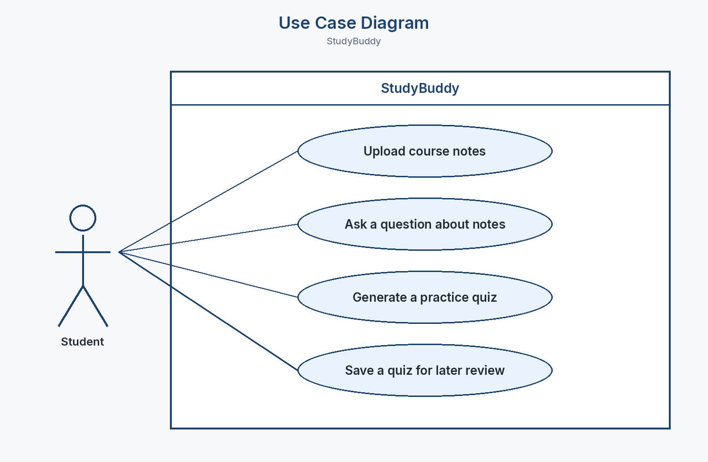
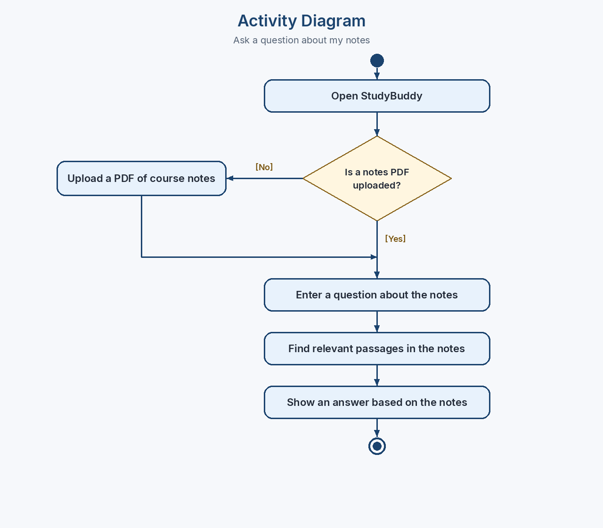

# In-class Activity: StudyBuddy UML

Practice diagrams for Milestone I. StudyBuddy is a Streamlit app where a student uploads course notes as a PDF, asks questions about them, generates a practice quiz, and saves quizzes to review later.

These are meant to be simple. The point is to show what the app does and how someone moves through one task.

## Use Case Diagram

The student stands outside the system. StudyBuddy is the box. The four ovals are the things the student can do.

## Activity Diagram

This is only the path for **Ask a question about my notes**. The diamond is the one decision: if no notes PDF is uploaded yet, the student uploads one first. Both paths meet before the question is typed, and the answer comes from the notes.

Generating a quiz and saving it are separate use cases, so they are not on this diagram.

## Critique, and what I changed

I sketched a first draft, then asked for a review. I kept the comments that made the diagrams clearer and skipped the ones that would have made them busier.

**Use cases are goals, not buttons.** The first names were "Upload PDF," "Chat," "Make quiz," and "Save quiz." "Chat" could mean any conversation, and this app only answers from the uploaded notes. "Save quiz" didn't say why the student would bother. They are now "Upload course notes," "Ask a question about notes," "Generate a practice quiz," and "Save a quiz for later review."

**Upload stays its own use case.** A review suggestion was to connect "Ask a question about notes" to "Upload course notes" with an include relationship, so asking always included uploading. That doesn't match how the app works: a student can upload once and then ask many questions. The activity diagram handles the case where nothing is uploaded yet.

**The decision comes before the question, and the branches join.** The first activity diagram repeated "type a question" and "show an answer" on both sides of the diamond. That made it look like two different tasks. Now `[No]` only adds "Upload a PDF of course notes," then that arrow joins the `[Yes]` path, and there is one question step after that.

**The answer has to come from the notes.** Stopping at "show an answer" made StudyBuddy look like a generic chatbot. I added "Find relevant passages in the notes" and worded the last step "Show an answer based on the notes."

**I left out a second decision and swimlanes.** A "was this answer helpful?" check, and separate lanes for the student and the app, would be reasonable later. This activity asked for one decision and a simple path, so I didn't add them.
